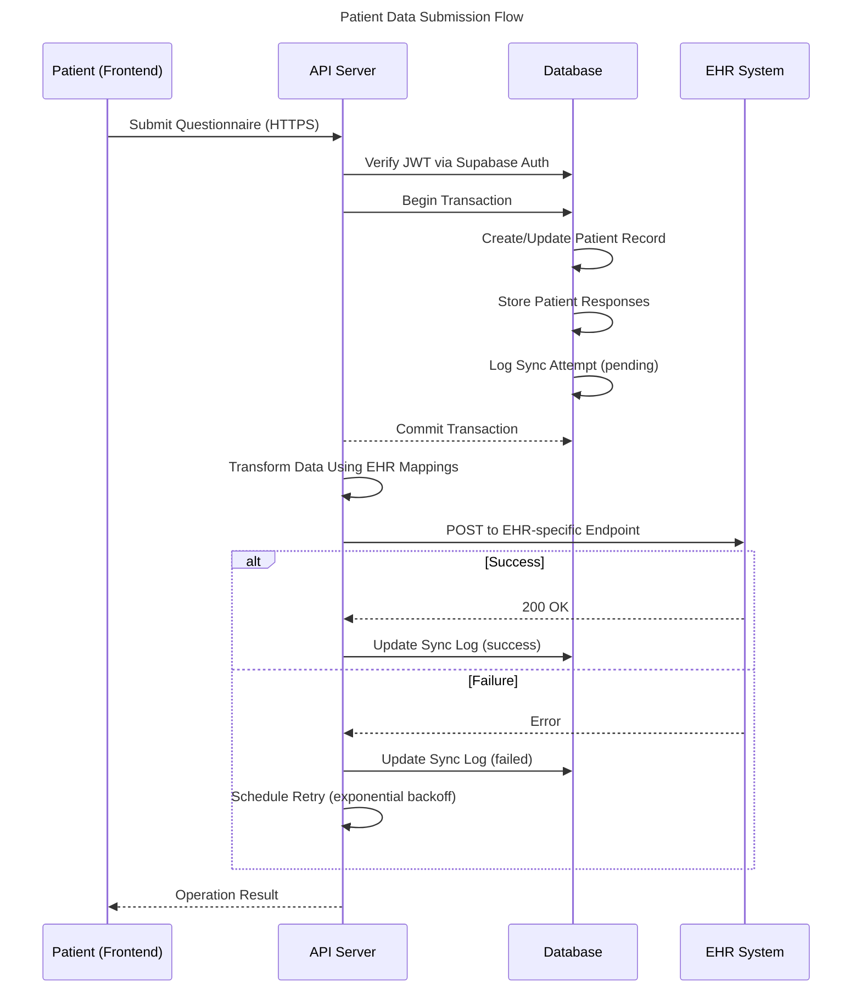
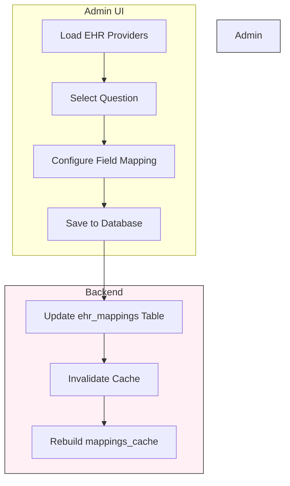
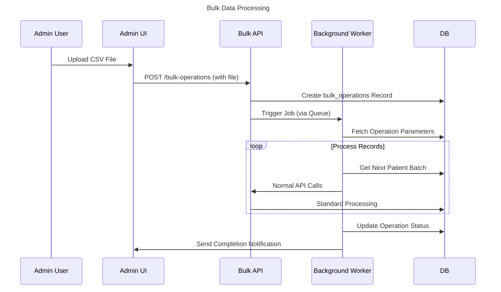
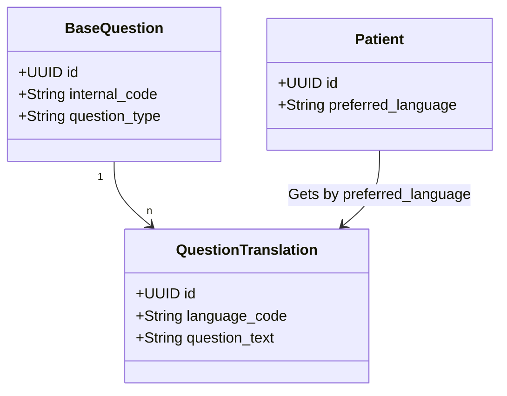
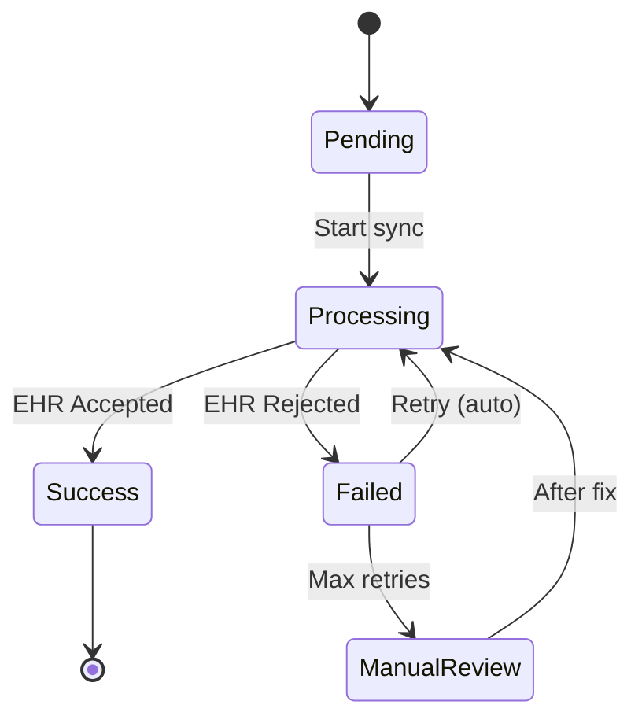
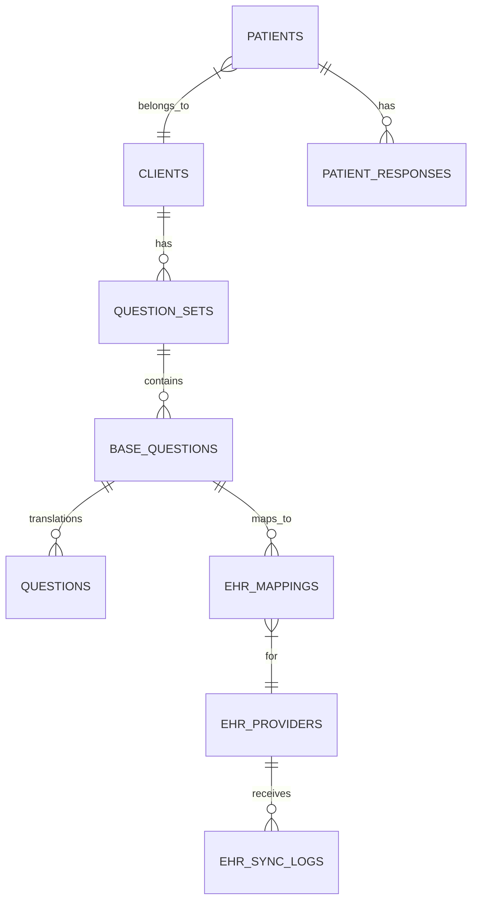

# EHR Manager
A comprehensive fullstack system to manage Electronic Health Resources for patients. This application provides a secure and efficient way to store, access, and manage patient health records electronically.

📋 Table of Contents
- [Overview](#-overview)
- [Diagrams](#diagrams)
  - [Core Data Flow](#core-data-flow)
  - [EHR Mapping Management](#ehr-mapping-management)
  - [Bulk Operations Flow](#bulk-operations-flow)
  - [Multi-Language Support](#multi-language-support)
  - [Error Recovery System](#error-recovery-system)
  - [Database Schema Overview](#database-schema-overview)
- [Architecture](#️-architecture)
- [Getting Started](#-getting-started)
  - [Prerequisites](#prerequisites)
  - [Installation](#installation)
  - [Development Environment](#development-environment)
  - [Production Deployment](#production-deployment)
- [Project Structure](#-project-structure)
  - [API (Backend)](#api-backend)
  - [Admin Site (Frontend)](#admin-site-frontend)
  - [Patient Site (Frontend)](#patient-site-frontend)
- [API Documentation](#-api-documentation)
- [Authorization and Authentication](#authorization-and-authentication)
- [Multilanguage Support](#multilanguage-support)
- [Testing](#-testing)
- [Bulk changes](#bulk-changes)
- [Audit Logs](#audit-logs)
- [Cache](#cache)
- [Split in microservices](#split-in-microservices)
- [EHR connections](#ehr-connections)
- [Error recovery](#error-recovery)
- [License](#-license)
- [Improvements and Future Development](#improvements-and-future-development)


## 🔍 Overview
EHR Manager is a modern solution for healthcare providers to manage patient records electronically. The system consists of:

- API Backend : Built with NestJS, providing robust and scalable server-side functionality
- Admin Portal : React-based interface for healthcare administrators and providers
- Patient Portal : React-based interface for patients to access their health record

## Diagrams
You can render the diagrams using a live editor like editor like [Mermaid Live Editor](https://mermaid.live)

### Core Data Flow

### EHR Mapping Management


### Bulk Operations Flow


### Multi-Language Support


### Error Recovery System


### Database Schema Overview


## 🏗️ Architecture
The application follows a modern microservices architecture:

- Backend : NestJS REST API with TypeScript
- Frontend :
  - Admin Site: React + TypeScript + Vite
  - Patients Site: React + TypeScript + Vite
- Database : PostgreSQL (managed through Prisma ORM) in a supabase instance
- Authentication : JWT for user authentication
- Containerization : Docker for development and production environments
- Deployment : Nginx for serving static frontend assets

## 🚀 Getting Started
### Prerequisites
- Node.js (v20 or later)
- pnpm (for API package management)
- npm (for frontend package management)
- Docker and Docker Compose (for containerized development/deployment)
- Git

### Installation
1. Clone the repository:
```bash
git clone https://github.com/RubenOAlvarado/ehr-manager.git
cd ehr-manager
```

2. Set up environment variables:
   - Create .env file in the project root directory for docker-compose based on the .env.example file.
   - Or if you want to run the project locally, create a .env file in the project root directory for the API, admin or patient portal.

### Development Environment
The project includes Docker configurations for easy development setup:

1. Start the development environment:
```bash
docker-compose up --build
```
This will start:

- API server on port 4000
- Admin site on port 3000
- Patients site on port 3001

### Production Deployment
For production deployment:

1. Build the Docker images:
```bash
docker-compose -f docker-compose.yml up --build
```

This will build optimized containers and deploy:

- API server (Node.js)
- Admin and Patient sites (served via Nginx)

## 📁 Project Structure
ehr-manager/
├── api/                  # NestJS backend API
├── admin-site/           # React admin portal
├── patients-site/        # React patient portal
├── docker/               # Docker configuration
│   ├── dev/              # Development Docker files
│   └── prod/             # Production Docker files
├── LICENSE               # MIT License
└── README.md             # This file

### API (Backend)
The API is built with NestJS, a progressive Node.js framework for building efficient and scalable server-side applications.

To run the API locally:
```bash
cd api
pnpm install
pnpm run start:dev
```

### Admin Site (Frontend)
The admin portal is built with React, TypeScript, and Vite for a modern development experience.

To run the admin site locally:
```bash
cd admin-site
npm install
npm run dev
```

### Patient Site (Frontend)
The patient portal is built with React, TypeScript, and Vite for a modern development experience.

To run the patient site locally:
```bash
cd patients-site
npm install
npm run dev
```

## 📚 API Documentation
API documentation is available at [API Documentation]`/api-docs` when the API is running.

## Authorization and Authentication
The application uses JWT (JSON Web Tokens) for user authentication. Users need to log in to access the admin portal.
Patients portal is open to the public, so they can respond the questions without creating an account. Future versions will add the ability to create an account and access the patient portal.

The API is secured with JWT, so users need to log in to request protected routes.
For both authentication and authorization, I used supabase.

## Multilanguage Support
The application is designed to support multiple languages. The default language is English, but it's planned to add support for Spanish and Portuguese.

Right now questionaries and answers are stored in the database, patients can selecte the language they want to answer the questions if there is a translation available. Each client can select the language they want to show the questions and answers.

## 🧪 Testing
The project is prepared for testing with Jest and Supertest on the backend. For frontend testing, Vitest will be used. Due to time constraints, testing is not fully implemented. But it's planned for future development.

## Bulk changes
The application is designed to support bulk changes, but it's not fully implemented. There are some examples in the database to show how it'll works. But a fully implementation can be added with more time.

## Audit Logs
The application is designed to support audit logs, but it's not fully implemented. There are some examples in the database to show how it'll works. But a fully implementation can be added with more time.

## Cache
Most frequent mapped questions are cached in a caching mappings table. This is done to improve performance. A more robust caching system can be added with more time, but it's a good starting point.

## Split in microservices
The API is designed in a modular way, so it can be split in microservices in the future. I tried to keep the code as modular as possible. So, in the future, it can be split in microservices.

## EHR connections
Right now the API just simulates a connection to an EHR. In the future, it can be connected to a real EHR, there is a client implemented as a service, but it's not fully implemented.

## Error recovery
The API is designed to recover from errors, configuring retries and retry schedules. Teh database records the status of the sync, so it can be recovered from errors and the error is logged in the database.

## 📄 License
This project is licensed under the MIT License - see the LICENSE file for details.

## Improvements and Future Development